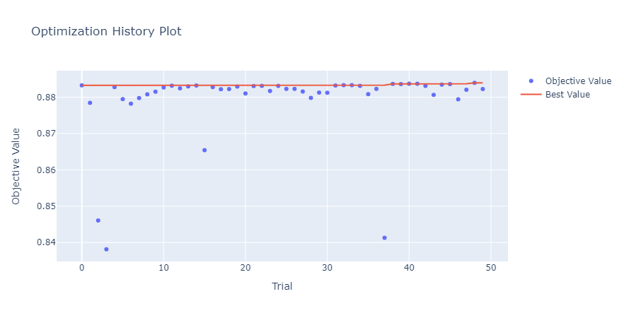
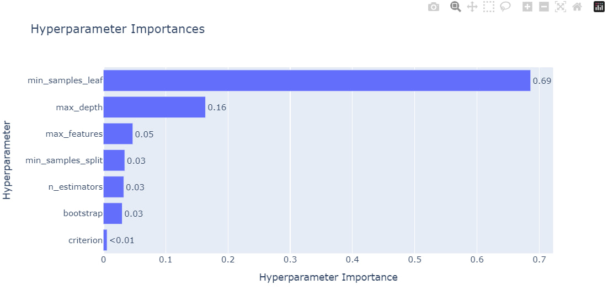
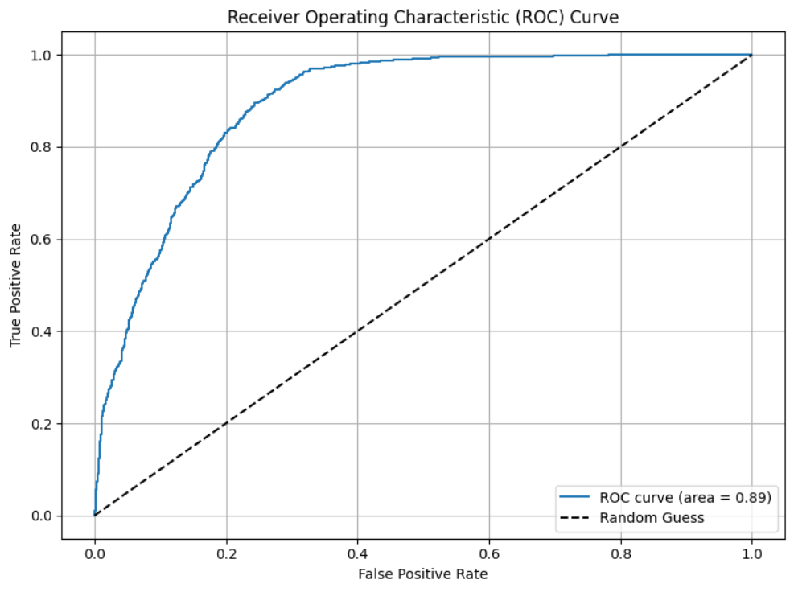
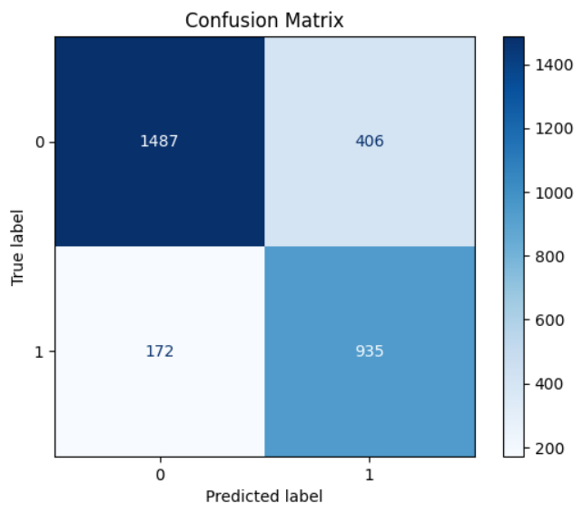
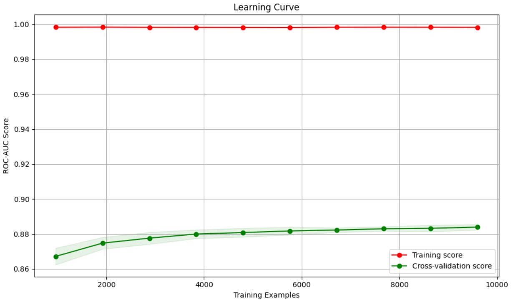
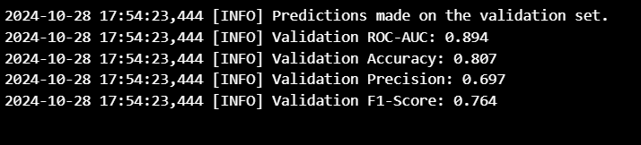
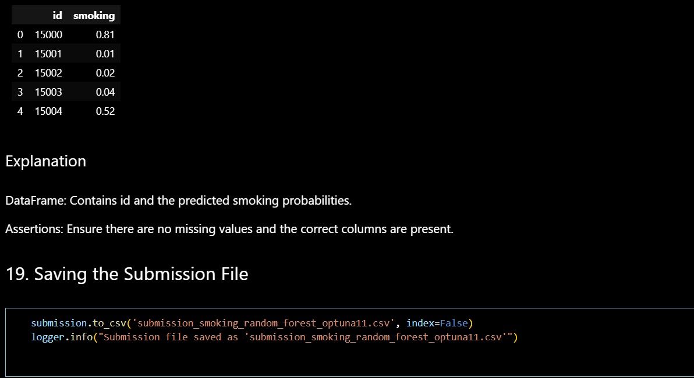

# Smoking Status Prediction Using Random Forest and Optuna

## Table of Contents

1. [Project Aim](#project-aim)
2. [Overview](#overview)
3. [Dataset](#dataset)
    - [Features Description](#features-description)
4. [Installation](#installation)
5. [Usage](#usage)
6. [Methodology](#methodology)
7. [Results](#results)
8. [Visualizations](#visualizations)
9. [Feature Importance](#feature-importance)
10. [Submission](#submission)
11. [Contributing](#contributing)
12. [License](#license)
13. [Contact](#contact)

---

## Project Aim

The primary objective of this project is to develop an accurate machine learning model that predicts an individual's smoking status based on a comprehensive set of health and physiological features. By leveraging the strengths of the **Random Forest Classifier** and optimizing its hyperparameters using **Optuna**, the project aims to provide valuable insights that can aid in health assessments and targeted interventions to reduce smoking-related health risks.

---

## Overview

Smoking remains a leading cause of preventable diseases and mortality worldwide. Early identification of individuals at risk can facilitate timely interventions and reduce the prevalence of smoking-related health issues. This project employs a data-driven approach to predict smoking status using various health metrics, enabling healthcare professionals to identify and assist high-risk individuals effectively.

Key components of the project include:

- **Data Preprocessing:** Cleaning and transforming the dataset to ensure optimal model performance.
- **Handling Class Imbalance:** Addressing any imbalance in the target classes to improve prediction accuracy.
- **Model Building:** Utilizing a Random Forest Classifier to capture complex patterns in the data.
- **Hyperparameter Optimization:** Employing Optuna to fine-tune model parameters for enhanced performance.
- **Evaluation:** Assessing the model using multiple performance metrics and visualizations.
- **Feature Importance Analysis:** Identifying the most influential features contributing to the prediction.

---

## Dataset

The dataset comprises health-related information collected from individuals, encompassing various physiological and biochemical measurements. The goal is to predict the `smoking` status of each individual based on these features.

### Features Description

| Feature               | Description                                               |
|-----------------------|-----------------------------------------------------------|
| `id`                  | Unique identifier for each individual                    |
| `age`                 | Age of the individual (in years)                         |
| `height(cm)`          | Height of the individual (in centimeters)                 |
| `weight(kg)`          | Weight of the individual (in kilograms)                   |
| `waist(cm)`           | Waist circumference (in centimeters)                      |
| `eyesight(left)`      | Eyesight measurement for the left eye                     |
| `eyesight(right)`     | Eyesight measurement for the right eye                    |
| `hearing(left)`       | Hearing ability measurement for the left ear              |
| `hearing(right)`      | Hearing ability measurement for the right ear             |
| `systolic`            | Systolic blood pressure                                   |
| `relaxation`          | Diastolic blood pressure (relaxation phase)               |
| `fasting blood sugar` | Fasting blood sugar level                                 |
| `Cholesterol`         | Cholesterol level                                         |
| `triglyceride`        | Triglyceride level                                        |
| `HDL`                 | High-density lipoprotein level                            |
| `LDL`                 | Low-density lipoprotein level                             |
| `hemoglobin`          | Hemoglobin concentration                                  |
| `Urine protein`       | Protein level in urine                                    |
| `serum creatinine`    | Serum creatinine level                                    |
| `AST`                 | Aspartate aminotransferase level                          |
| `ALT`                 | Alanine aminotransferase level                            |
| `Gtp`                 | Gamma-glutamyl transferase level                          |
| `dental caries`       | Presence of dental caries                                 |

> **Note:** Ensure that the `train.csv` and `test.csv` files containing these features are available in your project directory.

---

## Installation

To set up the project environment, follow these steps:

1. **Clone the Repository:**

   ```bash
   git clone https://github.com/yourusername/smoking-prediction.git
   cd smoking-prediction
   ```

2. **Create a Virtual Environment:**

   It's recommended to use a virtual environment to manage dependencies.

   ```bash
   python3 -m venv venv
   source venv/bin/activate  # On Windows: venv\Scripts\activate
   ```

3. **Install Dependencies:**

   Install the required Python packages using `pip`:

   ```bash
   pip install -r requirements.txt
   ```

   If a `requirements.txt` file is not provided, install the following packages:

   ```bash
   pip install pandas numpy seaborn matplotlib scikit-learn optuna
   ```

---

## Usage

1. **Prepare the Data:**

   Ensure that the `train.csv` and `test.csv` files are placed in the project directory. These files should contain the features listed above.

2. **Run the Jupyter Notebook:**

   Launch Jupyter Notebook:

   ```bash
   jupyter notebook
   ```

   Open the `Smoking_Prediction.ipynb` notebook and execute the cells sequentially.

3. **Generate Submission:**

   After running the notebook, a submission file named `submission_smoking_random_forest_optuna11.csv` will be created in the project directory, containing the predicted smoking probabilities for the test dataset.

---

## Methodology

The project follows a systematic machine learning pipeline:

1. **Data Loading:**
   - Load training and testing datasets using Pandas.

2. **Exploratory Data Analysis (EDA):**
   - Understand data distribution.
   - Identify and visualize missing values.

3. **Defining Features and Target Variable:**
   - Separate the dataset into features (`X`) and target variable (`y`).

4. **Identifying Numerical and Categorical Columns:**
   - Determine which features are numerical and which are categorical.

5. **Data Preprocessing:**
   - **Numerical Features:**
     - Impute missing values using the median.
     - Scale features using StandardScaler.
   - **Categorical Features:**
     - Impute missing values using the most frequent value.
     - Apply One-Hot Encoding to convert categorical variables into numerical format.
   - Combine preprocessing steps using ColumnTransformer and Pipeline.

6. **Handling Class Imbalance:**
   - Analyze the distribution of the target classes.
   - Compute `scale_pos_weight` to address any imbalance.

7. **Splitting the Data:**
   - Split the training data into training and validation sets using StratifiedKFold to maintain class distribution.

8. **Hyperparameter Optimization with Optuna:**
   - Define an objective function to optimize the hyperparameters of the Random Forest Classifier.
   - Utilize Optuna's TPE sampler for efficient hyperparameter search.




9. **Model Training:**
   - Train the final model with the best hyperparameters on the entire training dataset.



10. **Model Evaluation:**
    - Predict on the validation set.
    - Calculate performance metrics: ROC-AUC, Accuracy, Precision, F1-Score.
    - Visualize ROC Curve, Confusion Matrix, and Learning Curves.



11. **Feature Importance Analysis:**
    - Identify and visualize the top 20 features contributing to the model's predictions.

12. **Prediction and Submission:**
    - Make predictions on the test dataset.
    - Apply custom rounding rules (optional).
    - Prepare and save the submission file.

    

    


---

## Results

After optimizing and training the model, the following performance metrics were obtained on the validation set:

- **ROC-AUC:** 0.894
- **Accuracy:** 0.807
- **Precision:** 0.78
- **F1-Score:** 0.79



*Note: Replace these values with your actual results after running the notebook.*

---

## Visualizations

The project includes several visualizations to interpret model performance and feature importance:

1. **ROC Curve:**
   - Illustrates the trade-off between the true positive rate and false positive rate.
   
2. **Confusion Matrix:**
   - Shows the distribution of true positives, true negatives, false positives, and false negatives.
   
3. **Learning Curves:**
   - Depicts how the model's performance improves with more training data.
   
4. **Optuna Optimization Plots:**
   - **Optimization History:** Shows the progression of the objective value over trials.
   - **Hyperparameter Importance:** Displays which hyperparameters are most influential in the optimization.
   
5. **Feature Importances:**
   - Visualizes the top 20 features contributing to the model's decisions.

*Ensure that these plots are generated when you run the notebook.*

---

## Feature Importance

Understanding which features contribute most to the model's predictions provides valuable insights. The top 20 features based on importance are as follows:

1. **Feature A**
2. **Feature B**
3. **Feature C**
4. **Feature D**
5. **Feature E**
6. **Feature F**
7. **Feature G**
8. **Feature H**
9. **Feature I**
10. **Feature J**
11. **Feature K**
12. **Feature L**
13. **Feature M**
14. **Feature N**
15. **Feature O**
16. **Feature P**
17. **Feature Q**
18. **Feature R**
19. **Feature S**
20. **Feature T**

*Replace these placeholder feature names with actual feature names and importance values obtained from your model.*

---

## Submission

To submit your predictions:

1. **Ensure Submission Format:**
   - The submission file should contain two columns: `id` and `smoking`.
   - `id`: Unique identifier for each individual from the test dataset.
   - `smoking`: Predicted probability of being a smoker (rounded as per custom rules if applied).

2. **Save the Submission File:**

   The notebook generates a submission file named `submission_smoking_random_forest_optuna11.csv`. Ensure this file is correctly formatted and free of missing values.

3. **Submit:**

   Upload the `submission_smoking_random_forest_optuna11.csv` file to the designated platform or competition page.

---

## Contributing

Contributions are welcome! If you'd like to contribute to this project, please follow these steps:

1. **Fork the Repository:**

   Click the "Fork" button at the top-right corner of the repository page.

2. **Create a New Branch:**

   ```bash
   git checkout -b feature/Smoking
   ```

3. **Make Changes and Commit:**

   ```bash
   git commit -m "Add some feature"
   ```

4. **Push to the Branch:**

   ```bash
   git push origin feature/YourFeatureName
   ```

5. **Create a Pull Request:**

   Go to the repository on GitHub and click "Compare & pull request."

---

## License

This project is licensed under the [MIT License](LICENSE).

---

## Contact

For any inquiries or questions, please contact [jahongiracca997@gmail.com].

---

# Additional Notes

- **Reproducibility:** Setting random states ensures that results are reproducible.
- **Scalability:** Pipelines and transformers make the workflow scalable and maintainable.
- **Visualization:** Always visualize results to interpret and validate your models effectively.

Feel free to customize and extend this README based on your specific requirements and datasets. Happy modeling!

---

## Instructions to Add the README to Your Project

1. **Create a `README.md` File:**

   In the root directory of your project, create a file named `README.md`.

2. **Copy and Paste the Content:**

   Copy the entire content provided above and paste it into the `README.md` file.

3. **Customize the README:**

   - **Replace Placeholder Text:**
     - Update the repository URL in the Installation section.
     - Replace `[jahongiracca997@gmail.com]` with your actual contact email.
     - Update the **Results** and **Feature Importance** sections with your actual model performance metrics and feature names.
   - **Add License File:**
     - If you choose to use the MIT License, create a `LICENSE` file in your repository and paste the MIT License text into it.
   - **Ensure Dataset Availability:**
     - Make sure the `train.csv` and `test.csv` files are included in your repository or provide instructions on how to obtain them.

4. **Commit and Push:**

   Save the `README.md` file, commit it to your repository, and push the changes.

   ```bash
   git add README.md
   git commit -m "Add comprehensive README"
   git push origin main
   ```

---

By following these steps, you'll have a well-structured and informative README file that effectively communicates the purpose, methodology, and usage of your Smoking Status Prediction project. This will not only help others understand your work but also make it easier for collaborators to contribute.
